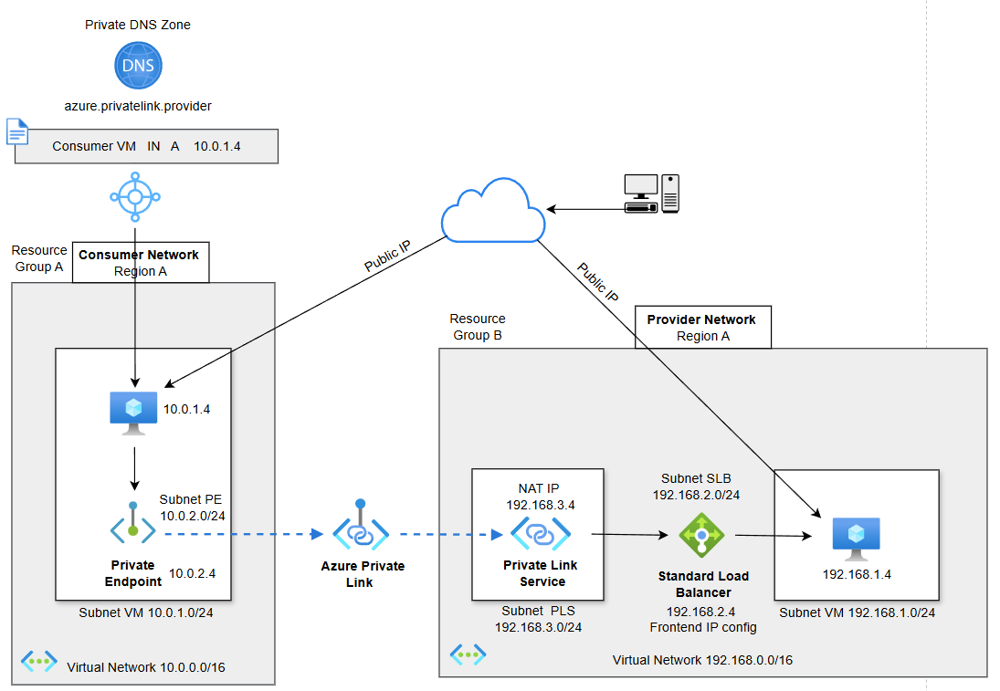

# Azure Deployment Resources for Testing

This repository contains the Terraform infrastructure required to provision Azure resources for **testing and validation purposes**.

The infrastructure defined here is used to support and execute the following test cases for this project:

- **TC-PLS-03**
- **TC-PLS-04**
## Prerequisites

Before deploying the infrastructure, ensure you have:

- An active Azure subscription
- Baic permissions on the target subscription
- Terraform >= 1.14.0
- Azure CLI installed and authenticated

```bash
az login
```

## Deployment
Deploying the infrastructure:

1. Initialize Terraform:
```bash
terraform init
```
2. Plan Terraform:
```bash
terraform plan
```
3. Apply Terraform:
```bash
terraform apply
```

## Cleanup

To remove all deployed resources and avoid unnecessary costs:

```bash
terraform destroy
```
---

## Infrastructure Overview

The following diagram illustrates the overall Azure infrastructure deployed by this repository.

### Required Azure Resources

The infrastructure is split into **consumer** and **provider** environments.

**Consumer side:**
- Resource Group  
- Virtual Network  
- Network Security Group (NSG)  
- Subnets  
- Virtual Machine  
- Network Interface Security Group Association  
- Private Endpoint  

**Provider side:**
- Resource Group  
- Virtual Network  
- Network Security Group (NSG)  
- Subnets  
- Virtual Machine  
- Network Interface Security Group Association  
- Standard Load Balancer (SLB)  
- Load Balancer Backend Pool  
- Backend Address Pool Association  
- Private Link Service (PLS)  



---

## Private Link Service Workflow

The diagram below illustrates the Private Link Service workflow used in the testing scenarios.

